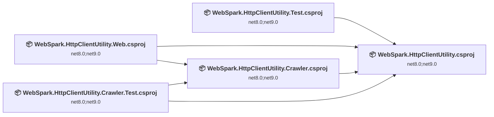
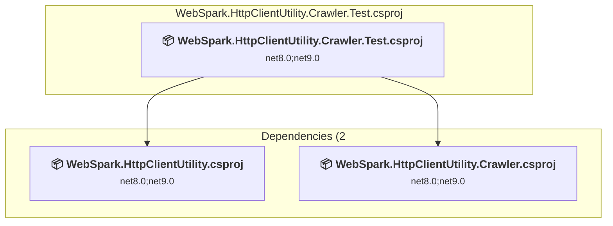
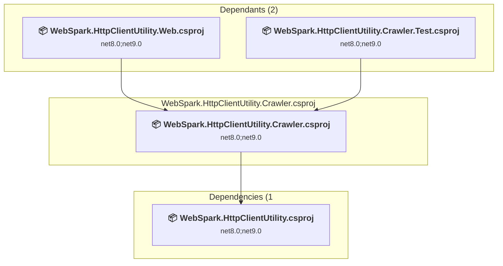
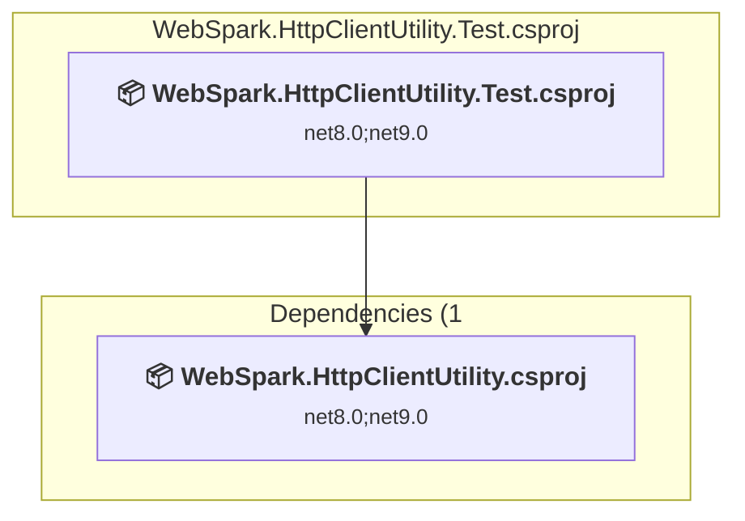
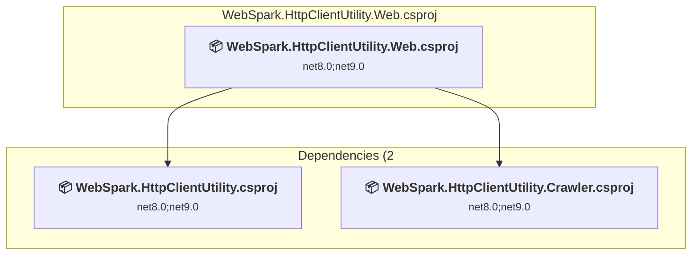
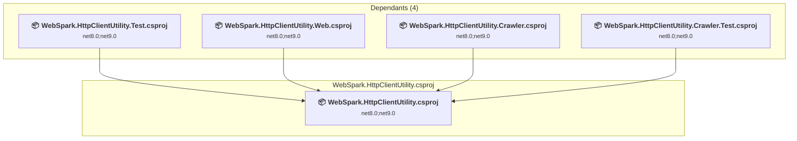

# Projects and dependencies analysis

This document provides a comprehensive overview of the projects and their dependencies in the context of upgrading to .NET 9.0.

## Table of Contents

- [Projects Relationship Graph](#projects-relationship-graph)
- [Project Details](#project-details)

  - [WebSpark.HttpClientUtility.Crawler.Test\WebSpark.HttpClientUtility.Crawler.Test.csproj](#websparkhttpclientutilitycrawlertestwebsparkhttpclientutilitycrawlertestcsproj)
  - [WebSpark.HttpClientUtility.Crawler\WebSpark.HttpClientUtility.Crawler.csproj](#websparkhttpclientutilitycrawlerwebsparkhttpclientutilitycrawlercsproj)
  - [WebSpark.HttpClientUtility.Test\WebSpark.HttpClientUtility.Test.csproj](#websparkhttpclientutilitytestwebsparkhttpclientutilitytestcsproj)
  - [WebSpark.HttpClientUtility.Web\WebSpark.HttpClientUtility.Web.csproj](#websparkhttpclientutilitywebwebsparkhttpclientutilitywebcsproj)
  - [WebSpark.HttpClientUtility\WebSpark.HttpClientUtility.csproj](#websparkhttpclientutilitywebsparkhttpclientutilitycsproj)
- [Aggregate NuGet packages details](#aggregate-nuget-packages-details)

## Projects Relationship Graph

Legend:
📦 SDK-style project
⚙️ Classic project

## Project Details

### WebSpark.HttpClientUtility.Crawler.Test\WebSpark.HttpClientUtility.Crawler.Test.csproj

#### Project Info

- **Current Target Framework:** net8.0;net9.0
- **Proposed Target Framework:** net8.0;net9.0;net10.0
- **SDK-style**: True
- **Project Kind:** DotNetCoreApp
- **Dependencies**: 2
- **Dependants**: 0
- **Number of Files**: 4
- **Lines of Code**: 458

#### Dependency Graph

Legend:
📦 SDK-style project
⚙️ Classic project

#### Project Package References

| Package | Type | Current Version | Suggested Version | Description |
| :--- | :---: | :---: | :---: | :--- |
| coverlet.collector | Explicit | 6.0.2 |  | ✅Compatible |
| Microsoft.NET.Test.Sdk | Explicit | 17.12.0 |  | ✅Compatible |
| Microsoft.SourceLink.GitHub | Explicit | 8.0.0 |  | ✅Compatible |
| Moq | Explicit | 4.20.72 |  | ✅Compatible |
| MSTest.TestAdapter | Explicit | 3.7.0 |  | ✅Compatible |
| MSTest.TestFramework | Explicit | 3.7.0 |  | ✅Compatible |
| OpenTelemetry.Exporter.InMemory | Explicit | 1.13.1 |  | ✅Compatible |

### WebSpark.HttpClientUtility.Crawler\WebSpark.HttpClientUtility.Crawler.csproj

#### Project Info

- **Current Target Framework:** net8.0;net9.0
- **Proposed Target Framework:** net8.0;net9.0;net10.0
- **SDK-style**: True
- **Project Kind:** ClassLibrary
- **Dependencies**: 1
- **Dependants**: 2
- **Number of Files**: 12
- **Lines of Code**: 2653

#### Dependency Graph

Legend:
📦 SDK-style project
⚙️ Classic project

#### Project Package References

| Package | Type | Current Version | Suggested Version | Description |
| :--- | :---: | :---: | :---: | :--- |
| CsvHelper | Explicit | 33.1.0 |  | ✅Compatible |
| HtmlAgilityPack | Explicit | 1.12.4 |  | ✅Compatible |
| Markdig | Explicit | 0.43.0 |  | ✅Compatible |
| Microsoft.SourceLink.GitHub | Explicit | 8.0.0 |  | ✅Compatible |

### WebSpark.HttpClientUtility.Test\WebSpark.HttpClientUtility.Test.csproj

#### Project Info

- **Current Target Framework:** net8.0;net9.0
- **Proposed Target Framework:** net8.0;net9.0;net10.0
- **SDK-style**: True
- **Project Kind:** DotNetCoreApp
- **Dependencies**: 1
- **Dependants**: 0
- **Number of Files**: 22
- **Lines of Code**: 4087

#### Dependency Graph

Legend:
📦 SDK-style project
⚙️ Classic project

#### Project Package References

| Package | Type | Current Version | Suggested Version | Description |
| :--- | :---: | :---: | :---: | :--- |
| coverlet.collector | Explicit | 6.0.4 |  | ✅Compatible |
| Microsoft.Extensions.Caching.Memory | Explicit | 8.0.1 | 10.0.0 | NuGet package upgrade is recommended |
| Microsoft.NET.Test.Sdk | Explicit | 18.0.0 |  | ✅Compatible |
| Microsoft.SourceLink.GitHub | Explicit | 8.0.0 |  | ✅Compatible |
| Moq | Explicit | 4.20.72 |  | ✅Compatible |
| MSTest.TestAdapter | Explicit | 4.0.1 |  | ✅Compatible |
| MSTest.TestFramework | Explicit | 4.0.1 |  | ✅Compatible |
| OpenTelemetry.Exporter.InMemory | Explicit | 1.13.1 |  | ✅Compatible |

### WebSpark.HttpClientUtility.Web\WebSpark.HttpClientUtility.Web.csproj

#### Project Info

- **Current Target Framework:** net8.0;net9.0
- **Proposed Target Framework:** net8.0;net9.0;net10.0
- **SDK-style**: True
- **Project Kind:** AspNetCore
- **Dependencies**: 2
- **Dependants**: 0
- **Number of Files**: 40
- **Lines of Code**: 4917

#### Dependency Graph

Legend:
📦 SDK-style project
⚙️ Classic project

#### Project Package References

| Package | Type | Current Version | Suggested Version | Description |
| :--- | :---: | :---: | :---: | :--- |
| Microsoft.Extensions.Caching.Memory | Explicit | 8.0.1 | 10.0.0 | NuGet package upgrade is recommended |
| Microsoft.SourceLink.GitHub | Explicit | 8.0.0 |  | ✅Compatible |

### WebSpark.HttpClientUtility\WebSpark.HttpClientUtility.csproj

#### Project Info

- **Current Target Framework:** net8.0;net9.0
- **Proposed Target Framework:** net8.0;net9.0;net10.0
- **SDK-style**: True
- **Project Kind:** ClassLibrary
- **Dependencies**: 0
- **Dependants**: 4
- **Number of Files**: 48
- **Lines of Code**: 6204

#### Dependency Graph

Legend:
📦 SDK-style project
⚙️ Classic project

#### Project Package References

| Package | Type | Current Version | Suggested Version | Description |
| :--- | :---: | :---: | :---: | :--- |
| Microsoft.Extensions.Caching.Abstractions | Explicit | 8.0.0 | 10.0.0 | NuGet package upgrade is recommended |
| Microsoft.Extensions.Caching.Memory | Explicit | 8.0.1 | 10.0.0 | NuGet package upgrade is recommended |
| Microsoft.Extensions.Http | Explicit | 8.0.1 | 10.0.0 | NuGet package upgrade is recommended |
| Microsoft.SourceLink.GitHub | Explicit | 8.0.0 |  | ✅Compatible |
| Newtonsoft.Json | Explicit | 13.0.4 |  | ✅Compatible |
| OpenTelemetry | Explicit | 1.13.1 |  | ✅Compatible |
| OpenTelemetry.Exporter.Console | Explicit | 1.13.1 |  | ✅Compatible |
| OpenTelemetry.Exporter.OpenTelemetryProtocol | Explicit | 1.13.1 |  | ✅Compatible |
| OpenTelemetry.Extensions.Hosting | Explicit | 1.13.1 |  | ✅Compatible |
| OpenTelemetry.Instrumentation.Http | Explicit | 1.13.0 |  | ✅Compatible |
| Polly | Explicit | 8.6.4 |  | ✅Compatible |

## Aggregate NuGet packages details

| Package | Current Version | Suggested Version | Projects | Description |
| :--- | :---: | :---: | :--- | :--- |
| coverlet.collector | 6.0.2 |  | [WebSpark.HttpClientUtility.Crawler.Test.csproj](#websparkhttpclientutilitycrawlertestcsproj) | ✅Compatible |
| coverlet.collector | 6.0.4 |  | [WebSpark.HttpClientUtility.Test.csproj](#websparkhttpclientutilitytestcsproj) | ✅Compatible |
| CsvHelper | 33.1.0 |  | [WebSpark.HttpClientUtility.Crawler.csproj](#websparkhttpclientutilitycrawlercsproj) | ✅Compatible |
| HtmlAgilityPack | 1.12.4 |  | [WebSpark.HttpClientUtility.Crawler.csproj](#websparkhttpclientutilitycrawlercsproj) | ✅Compatible |
| Markdig | 0.43.0 |  | [WebSpark.HttpClientUtility.Crawler.csproj](#websparkhttpclientutilitycrawlercsproj) | ✅Compatible |
| Microsoft.Extensions.Caching.Abstractions | 8.0.0 | 10.0.0 | [WebSpark.HttpClientUtility.csproj](#websparkhttpclientutilitycsproj) | NuGet package upgrade is recommended |
| Microsoft.Extensions.Caching.Memory | 8.0.1 | 10.0.0 | [WebSpark.HttpClientUtility.Test.csproj](#websparkhttpclientutilitytestcsproj) [WebSpark.HttpClientUtility.Web.csproj](#websparkhttpclientutilitywebcsproj) [WebSpark.HttpClientUtility.csproj](#websparkhttpclientutilitycsproj) | NuGet package upgrade is recommended |
| Microsoft.Extensions.Http | 8.0.1 | 10.0.0 | [WebSpark.HttpClientUtility.csproj](#websparkhttpclientutilitycsproj) | NuGet package upgrade is recommended |
| Microsoft.NET.Test.Sdk | 17.12.0 |  | [WebSpark.HttpClientUtility.Crawler.Test.csproj](#websparkhttpclientutilitycrawlertestcsproj) | ✅Compatible |
| Microsoft.NET.Test.Sdk | 18.0.0 |  | [WebSpark.HttpClientUtility.Test.csproj](#websparkhttpclientutilitytestcsproj) | ✅Compatible |
| Microsoft.SourceLink.GitHub | 8.0.0 |  | [WebSpark.HttpClientUtility.Crawler.Test.csproj](#websparkhttpclientutilitycrawlertestcsproj) [WebSpark.HttpClientUtility.Crawler.csproj](#websparkhttpclientutilitycrawlercsproj) [WebSpark.HttpClientUtility.Test.csproj](#websparkhttpclientutilitytestcsproj) [WebSpark.HttpClientUtility.Web.csproj](#websparkhttpclientutilitywebcsproj) [WebSpark.HttpClientUtility.csproj](#websparkhttpclientutilitycsproj) | ✅Compatible |
| Moq | 4.20.72 |  | [WebSpark.HttpClientUtility.Crawler.Test.csproj](#websparkhttpclientutilitycrawlertestcsproj) [WebSpark.HttpClientUtility.Test.csproj](#websparkhttpclientutilitytestcsproj) | ✅Compatible |
| MSTest.TestAdapter | 3.7.0 |  | [WebSpark.HttpClientUtility.Crawler.Test.csproj](#websparkhttpclientutilitycrawlertestcsproj) | ✅Compatible |
| MSTest.TestAdapter | 4.0.1 |  | [WebSpark.HttpClientUtility.Test.csproj](#websparkhttpclientutilitytestcsproj) | ✅Compatible |
| MSTest.TestFramework | 3.7.0 |  | [WebSpark.HttpClientUtility.Crawler.Test.csproj](#websparkhttpclientutilitycrawlertestcsproj) | ✅Compatible |
| MSTest.TestFramework | 4.0.1 |  | [WebSpark.HttpClientUtility.Test.csproj](#websparkhttpclientutilitytestcsproj) | ✅Compatible |
| Newtonsoft.Json | 13.0.4 |  | [WebSpark.HttpClientUtility.csproj](#websparkhttpclientutilitycsproj) | ✅Compatible |
| OpenTelemetry | 1.13.1 |  | [WebSpark.HttpClientUtility.csproj](#websparkhttpclientutilitycsproj) | ✅Compatible |
| OpenTelemetry.Exporter.Console | 1.13.1 |  | [WebSpark.HttpClientUtility.csproj](#websparkhttpclientutilitycsproj) | ✅Compatible |
| OpenTelemetry.Exporter.InMemory | 1.13.1 |  | [WebSpark.HttpClientUtility.Crawler.Test.csproj](#websparkhttpclientutilitycrawlertestcsproj) [WebSpark.HttpClientUtility.Test.csproj](#websparkhttpclientutilitytestcsproj) | ✅Compatible |
| OpenTelemetry.Exporter.OpenTelemetryProtocol | 1.13.1 |  | [WebSpark.HttpClientUtility.csproj](#websparkhttpclientutilitycsproj) | ✅Compatible |
| OpenTelemetry.Extensions.Hosting | 1.13.1 |  | [WebSpark.HttpClientUtility.csproj](#websparkhttpclientutilitycsproj) | ✅Compatible |
| OpenTelemetry.Instrumentation.Http | 1.13.0 |  | [WebSpark.HttpClientUtility.csproj](#websparkhttpclientutilitycsproj) | ✅Compatible |
| Polly | 8.6.4 |  | [WebSpark.HttpClientUtility.csproj](#websparkhttpclientutilitycsproj) | ✅Compatible |

