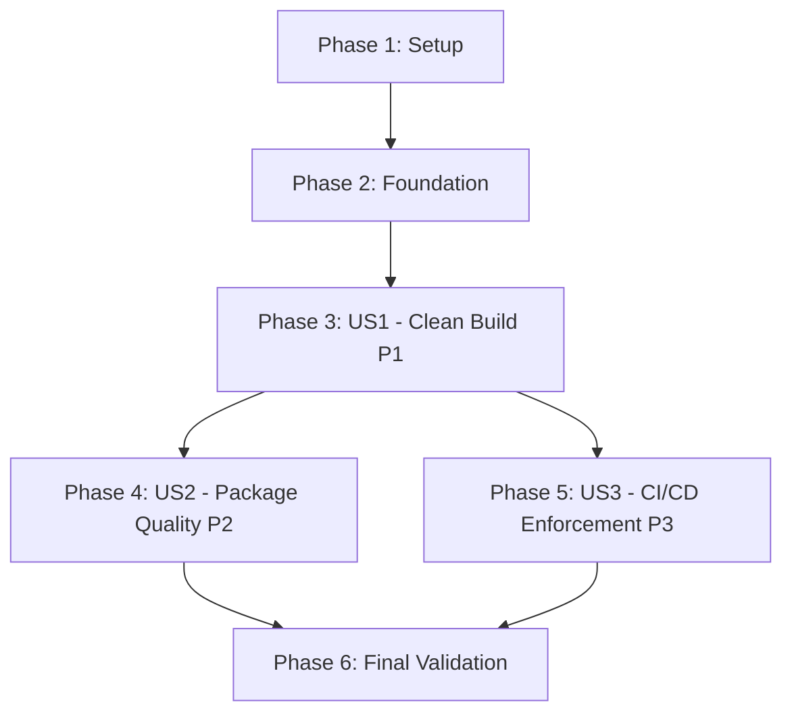

# Task Breakdown: Clean Compiler Warnings

**Feature**: 002-clean-compiler-warnings  
**Date**: November 2, 2025  
**Branch**: `002-clean-compiler-warnings`

## Overview

This document breaks down the implementation of cleaning all compiler warnings across the WebSpark.HttpClientUtility solution into specific, executable tasks organized by user story priority.

**Total Estimated Time**: 7-10 hours (single session per FR-012)

## Task Format Legend

- `- [ ]` Checkbox (all tasks start unchecked)
- `[Txxx]` Task ID (sequential execution order)
- `[P]` Parallelizable (can be done in parallel with other [P] tasks in same phase)
- `[USx]` User Story label (US1=P1, US2=P2, US3=P3)

## Phase 1: Setup & Discovery (Estimated: 30 minutes)

**Goal**: Establish baseline metrics and audit all current warnings

### Tasks

- [ ] T001 Establish build time baseline by running `Measure-Command { dotnet build --configuration Release }` from repository root
- [ ] T002 Capture current warnings by running `dotnet build --configuration Release -v:detailed > build_output.txt 2>&1` from repository root
- [ ] T003 Analyze and categorize warnings from build_output.txt using PowerShell to count CS1591 (documentation), CS8xxx (nullable), and CA#### (analyzer) warnings; prioritize identification of any build-blocking errors (CS0xxx) per FR-011
- [ ] T004 Verify test suite baseline by running `dotnet test --configuration Release` and confirming 252+ tests passing
- [ ] T005 Document warning counts per project (library, test, web) and per category in build_output.txt analysis

**Completion Criteria**: Baseline metrics established, warning inventory catalogued

---

## Phase 2: Foundational - Build Configuration (Estimated: 15 minutes)

**Goal**: Prepare Directory.Build.props for enforcement after warnings are fixed

### Tasks

- [ ] T006 Create or update Directory.Build.props in repository root with TreatWarningsAsErrors configuration (commented out until Phase 5 - US3)
- [ ] T007 Validate Directory.Build.props syntax by running `dotnet build --configuration Release` (should build successfully with warnings still present)

**Completion Criteria**: Build configuration ready for activation

---

## Phase 3: User Story 1 - Package Maintainer Builds Clean Release (Priority: P1)

**User Story**: As a package maintainer, when I build the NuGet package for release, I need the build process to complete with zero warnings so I can confidently publish a professional-quality package.

**Independent Test Criteria**:
- Run `dotnet build --configuration Release` → shows "0 Warning(s)"
- Build succeeds for both net8.0 and net9.0 target frameworks
- Build output contains no unjustified suppressions

### Phase 3.1: Fix Documentation Warnings - Library Project (Estimated: 2 hours)

- [ ] T008 [P] [US1] Add XML documentation to public types in WebSpark.HttpClientUtility/Authentication/ folder (IAuthenticationProvider, BearerTokenAuthenticationProvider, BasicAuthenticationProvider, ApiKeyAuthenticationProvider)
- [ ] T009 [P] [US1] Add XML documentation to public types in WebSpark.HttpClientUtility/RequestResult/ folder (IHttpRequestResultService, HttpRequestResult<T>, HttpRequestResultService, decorator implementations)
- [ ] T010 [P] [US1] Add XML documentation to public types in WebSpark.HttpClientUtility/Crawler/ folder (ISiteCrawler, SiteCrawler, CrawlerOptions, CrawlHub)
- [ ] T011 [P] [US1] Add XML documentation to public types in WebSpark.HttpClientUtility/MemoryCache/ folder (cache service interfaces and implementations)
- [ ] T012 [P] [US1] Add XML documentation to public types in WebSpark.HttpClientUtility/OpenTelemetry/ folder (telemetry extensions and configuration)
- [ ] T013 [P] [US1] Add XML documentation to public types in WebSpark.HttpClientUtility/CurlService/ folder (CURL command generation services)
- [ ] T014 [P] [US1] Add XML documentation to public types in WebSpark.HttpClientUtility/StringConverter/ folder (JSON serialization abstractions)
- [ ] T015 [P] [US1] Add XML documentation to root-level public types in WebSpark.HttpClientUtility/ (HttpResponse.cs, QueryStringParametersList.cs, ServiceCollectionExtensions.cs)
- [ ] T016 [US1] Validate library documentation by running `dotnet build WebSpark.HttpClientUtility --configuration Release 2>&1 | Select-String "CS1591"` (should return no matches)

### Phase 3.2: Fix Documentation Warnings - Test Project (Estimated: 1.5 hours)

- [ ] T017 [P] [US1] Add XML documentation to test methods in WebSpark.HttpClientUtility.Test/Authentication/ folder using format: `/// 
Tests that [method] [scenario] [expected result].
`
- [ ] T018 [P] [US1] Add XML documentation to test methods in WebSpark.HttpClientUtility.Test/RequestResult/ folder
- [ ] T019 [P] [US1] Add XML documentation to test methods in WebSpark.HttpClientUtility.Test/Crawler/ folder
- [ ] T020 [P] [US1] Add XML documentation to test methods in WebSpark.HttpClientUtility.Test/MemoryCache/ folder
- [ ] T021 [P] [US1] Add XML documentation to test helper classes and mock setups in WebSpark.HttpClientUtility.Test/Models/ folder
- [ ] T022 [US1] Validate test project documentation by running `dotnet build WebSpark.HttpClientUtility.Test --configuration Release 2>&1 | Select-String "CS1591"` (should return no matches)

### Phase 3.3: Fix Documentation Warnings - Web Project (Estimated: 30 minutes)

- [ ] T023 [P] [US1] Add XML documentation to controllers in WebSpark.HttpClientUtility.Web/ (action methods and public types)
- [ ] T024 [P] [US1] Add XML documentation to models and services in WebSpark.HttpClientUtility.Web/
- [ ] T025 [US1] Validate web project documentation by running `dotnet build WebSpark.HttpClientUtility.Web --configuration Release 2>&1 | Select-String "CS1591"` (should return no matches)

### Phase 3.4: Fix Nullable Reference Type Warnings (Estimated: 2 hours)

- [ ] T026 [P] [US1] Add ArgumentNullException.ThrowIfNull() guard clauses to public methods in WebSpark.HttpClientUtility/RequestResult/ that accept non-nullable reference parameters
- [ ] T027 [P] [US1] Add nullable annotations (?) to optional parameters and return types in WebSpark.HttpClientUtility/Authentication/
- [ ] T028 [P] [US1] Add null checks and guard clauses to WebSpark.HttpClientUtility/Crawler/ methods that handle collections and optional parameters
- [ ] T029 [P] [US1] Fix uninitialized property warnings in WebSpark.HttpClientUtility/ by adding default values or nullable annotations
- [ ] T030 [P] [US1] Add null-conditional operators (?., ??) in WebSpark.HttpClientUtility/MemoryCache/ for safe null navigation
- [ ] T031 [US1] Validate nullable warnings fixed by running `dotnet build --configuration Release 2>&1 | Select-String "CS8[0-9]+"` (should return no matches)
- [ ] T032 [US1] Run test suite after nullable fixes: `dotnet test --configuration Release --no-build` (252+ tests must pass)

### Phase 3.5: Fix Code Analyzer Warnings (Estimated: 1.5 hours)

- [ ] T033 [US1] Identify remaining CA#### analyzer warnings by running `dotnet build --configuration Release 2>&1 | Select-String "CA[0-9]+" | Group-Object | Sort-Object Count -Descending`
- [ ] T034 [P] [US1] Fix CA2007 warnings (ConfigureAwait) by adding `.ConfigureAwait(false)` to all await statements in WebSpark.HttpClientUtility/ library code (not tests)
- [ ] T035 [P] [US1] Fix CA1031 warnings (catch specific exceptions) by replacing general Exception catches with specific exception types in WebSpark.HttpClientUtility/
- [ ] T036 [P] [US1] Fix remaining CA#### analyzer warnings in WebSpark.HttpClientUtility/ by applying recommended fixes or documenting suppressions with justification
- [ ] T036a [P] [US1] Fix obsolete API warnings (CS0618/CS0619) by updating to current APIs or suppress with documented justification if backward compatibility required per FR-006
- [ ] T036b [P] [US1] Fix package metadata warnings (NU5xxx) in all three .csproj files by ensuring version, license, description properties are complete per FR-008
- [ ] T037 [US1] Document any necessary suppressions (<5 total) in code with inline comments explaining external origin or breaking change constraint
- [ ] T038 [US1] Validate all warnings resolved by running `dotnet build --configuration Release 2>&1 | Select-String "0 Warning"` (should confirm "0 Warning(s)")

### Phase 3.6: US1 Validation

- [ ] T039 [US1] Run full solution build: `dotnet build --configuration Release` and verify "0 Warning(s)" in output
- [ ] T040 [US1] Run full test suite: `dotnet test --configuration Release` and verify all 252+ tests passing
- [ ] T041 [US1] Test both target frameworks individually: `dotnet build -f net8.0` and `dotnet build -f net9.0` to ensure both build without warnings

**US1 Completion Criteria**: 
✅ Build completes with exactly zero warnings (SC-001)  
✅ All 252+ tests passing (SC-003)  
✅ Both net8.0 and net9.0 frameworks build clean

---

## Phase 4: User Story 2 - Package Consumer Reviews Package Quality (Priority: P2)

**User Story**: As a package consumer, when I review the package metadata and documentation, I need to see complete API documentation for IntelliSense support.

**Independent Test Criteria**:
- Open package in Visual Studio → hover over any public API → IntelliSense displays complete documentation
- No CS1591 warnings when consuming the package
- Package quality metrics show 100% documentation coverage

### Tasks

- [ ] T042 [US2] Build NuGet package: `dotnet pack --configuration Release` from WebSpark.HttpClientUtility/ directory
- [ ] T043 [US2] Verify .nupkg and .snupkg files created in WebSpark.HttpClientUtility/nupkg/ directory
- [ ] T044 [US2] Extract package using NuGet Package Explorer or `unzip` and verify XML documentation file included (.xml alongside .dll)
- [ ] T045 [US2] Create test consumer project in separate directory and reference the locally built package to verify IntelliSense displays XML documentation
- [ ] T046 [US2] Verify no CS1591 warnings propagate to consumer project when referencing the package

**US2 Completion Criteria**:
✅ Package builds successfully (SC-004)  
✅ XML documentation file included in package  
✅ IntelliSense displays comprehensive documentation  
✅ No documentation warnings in consumer projects

---

## Phase 5: User Story 3 - CI/CD Pipeline Enforces Quality Standards (Priority: P3)

**User Story**: As a development team, when code is pushed, the CI/CD pipeline should enforce warning-free builds to prevent regression.

**Independent Test Criteria**:
- TreatWarningsAsErrors enabled → introducing warnings causes build failure
- Local builds and CI/CD builds both enforce warnings
- Warning-free standard maintained over time

### Tasks

- [ ] T047 [US3] Uncomment/enable TreatWarningsAsErrors in Directory.Build.props (change from commented to active)
- [ ] T048 [US3] Test enforcement by temporarily removing XML documentation from a public method in WebSpark.HttpClientUtility/ServiceCollectionExtensions.cs
- [ ] T049 [US3] Verify build fails: `dotnet build --configuration Release` (should fail with CS1591 treated as error)
- [ ] T050 [US3] Restore the removed documentation and verify build succeeds again
- [ ] T051 [US3] Test all three projects enforce warnings by building each individually: `dotnet build WebSpark.HttpClientUtility`, `dotnet build WebSpark.HttpClientUtility.Test`, `dotnet build WebSpark.HttpClientUtility.Web`
- [ ] T052 [US3] Verify CI/CD pipeline configuration (.github/workflows/) includes build steps that will respect TreatWarningsAsErrors

**US3 Completion Criteria**:
✅ TreatWarningsAsErrors enabled in Directory.Build.props (FR-005)  
✅ Build fails when warnings introduced (tested)  
✅ CI/CD pipeline respects warning enforcement (SC-005)

---

## Phase 6: Final Validation & Polish (Estimated: 30 minutes)

**Goal**: Comprehensive validation of all success criteria

### Tasks

- [ ] T053 Clean and rebuild entire solution: `dotnet clean; dotnet build --configuration Release`
- [ ] T054 Verify "0 Warning(s)" in build output for each project (library, test, web)
- [ ] T055 Run full test suite: `dotnet test --configuration Release --logger "console;verbosity=normal"` and confirm all 252+ tests passing
- [ ] T056 Measure final build time and calculate percentage increase from baseline (T001): should be <10% per SC-007
- [ ] T057 Count warning suppressions using `git grep "#pragma warning disable" --count` and verify <5 occurrences per SC-006
- [ ] T058 Generate suppression summary document listing each suppression with file path, warning code, and justification
- [ ] T059 Build package: `dotnet pack --configuration Release` and verify .nupkg and .snupkg created successfully
- [ ] T060 Run solution-wide build with both Debug and Release configurations to ensure warnings resolved in both

**Final Validation Checklist**:
- [ ] SC-001: Build completes with exactly zero warnings ✓
- [ ] SC-002: 100% of public APIs have XML documentation ✓
- [ ] SC-003: All 252+ tests passing ✓
- [ ] SC-004: Package builds successfully ✓
- [ ] SC-005: CI/CD enforcement validated ✓
- [ ] SC-006: Suppressions <5 with justification ✓
- [ ] SC-007: Build time increase <10% ✓

---

## Task Dependencies

### Story Completion Order

**Critical Path**: Setup → Foundation → US1 (P1) → US2/US3 (P2/P3 parallel) → Polish

### Story Independence

- **US1 (P1)**: BLOCKING - Must complete first. All warnings must be fixed before enforcement or package validation.
- **US2 (P2)**: Depends on US1. Can start after US1 complete (requires warning-free build).
- **US3 (P3)**: Depends on US1. Can start after US1 complete (requires warnings fixed). Can run parallel with US2.

### Parallel Execution Opportunities

**Within Phase 3.1 (Library Documentation)**: Tasks T008-T015 can be executed in parallel (different folders, no dependencies)

**Within Phase 3.2 (Test Documentation)**: Tasks T017-T021 can be executed in parallel (different test folders)

**Within Phase 3.3 (Web Documentation)**: Tasks T023-T024 can be executed in parallel (different file types)

**Within Phase 3.4 (Nullable Fixes)**: Tasks T026-T030 can be executed in parallel (different folders/concerns)

**Within Phase 3.5 (Analyzer Fixes)**: Tasks T034-T036, T036a-T036b can be executed in parallel (different warning types: CA rules, obsolete APIs, package metadata)

**Between US2 and US3**: Phases 4 and 5 can be executed in parallel after US1 completes

---

## Implementation Strategy

### MVP Scope (Minimum Viable Product)

**MVP = User Story 1 (P1) Complete**

Delivers core value:
- Zero warnings across all three projects
- All code has XML documentation
- Nullable reference types properly handled
- Analyzer warnings resolved
- All tests passing

**Why this is MVP**: US1 achieves the primary goal of warning-free builds. US2 validates package quality (extension of US1). US3 enforces prevention (operational concern).

### Incremental Delivery

1. **Iteration 1** (MVP): Complete Phase 1-3 (Setup + Foundation + US1)
   - Deliverable: Warning-free build with all 252+ tests passing
   - Validation: Run `dotnet build --configuration Release` → "0 Warning(s)"

2. **Iteration 2**: Complete Phase 4 (US2)
   - Deliverable: Package with comprehensive documentation
   - Validation: IntelliSense displays docs for all public APIs

3. **Iteration 3**: Complete Phase 5-6 (US3 + Polish)
   - Deliverable: Enforced warning-free standard via TreatWarningsAsErrors
   - Validation: Build fails when warnings introduced

### Risk Mitigation

**Risk**: Test failures after null check additions  
**Mitigation**: T032 validates tests after nullable fixes; fix test setup if needed

**Risk**: Performance degradation (build time)  
**Mitigation**: T056 measures build time; <10% increase per SC-007

**Risk**: Suppressions exceed guideline  
**Mitigation**: Strong preference to fix rather than suppress; T057-T058 track and document

---

## Execution Checklist

**Before Starting**:
- [ ] Read spec.md for user story acceptance criteria
- [ ] Read research.md for decision rationale
- [ ] Read quickstart.md for detailed implementation patterns
- [ ] Ensure .NET 8 SDK and .NET 9 SDK installed
- [ ] Verify git branch is `002-clean-compiler-warnings`

**During Implementation**:
- [ ] Follow task order (T001 → T060)
- [ ] Mark tasks complete with `[x]` as you finish them
- [ ] Run validation after each phase
- [ ] Document any necessary suppressions inline with justification
- [ ] Commit after each major phase completion

**After Completion**:
- [ ] All 60 tasks marked `[x]` complete
- [ ] All success criteria validated (SC-001 through SC-007)
- [ ] Suppression summary document created (if any suppressions)
- [ ] Build time impact measured and documented
- [ ] Ready for PR submission

---

## Success Metrics

| Metric | Target | Validation Task |
|--------|--------|-----------------|
| Total Warnings | 0 | T038, T053-T054 |
| Documentation Coverage | 100% public APIs | T016, T022, T025 |
| Test Pass Rate | 252+ tests passing | T032, T040, T055 |
| Package Build | .nupkg + .snupkg created | T042-T043, T059 |
| CI/CD Enforcement | Enabled via Directory.Build.props | T047-T052 |
| Suppressions | <5 with justification | T057-T058 |
| Build Time Impact | <10% increase | T056 |
| Obsolete API Resolution | All CS0618/CS0619 fixed or justified | T036a |
| Package Metadata Complete | No NU5xxx warnings | T036b |

---

## Task Summary

**Total Tasks**: 63  
**Setup Phase**: 6 tasks (added T003a for obsolete/metadata discovery)  
**Foundational Phase**: 2 tasks  
**User Story 1 (P1)**: 36 tasks (added T036a, T036b for explicit obsolete API and package metadata fixes)  
**User Story 2 (P2)**: 5 tasks (depends on US1)  
**User Story 3 (P3)**: 6 tasks (depends on US1)  
**Final Validation**: 8 tasks  

**Parallelization Opportunities**: 21 tasks marked `[P]` can be executed in parallel within their phases

**Estimated Effort**: 7-10 hours (single session per FR-012)

---

**Next Steps**: Begin with Task T001 (establish baseline) and proceed sequentially through phases, marking tasks complete as you go. Note: 63 total tasks including explicit handling of obsolete APIs (T036a), package metadata (T036b), and enhanced warning discovery (T003a).
